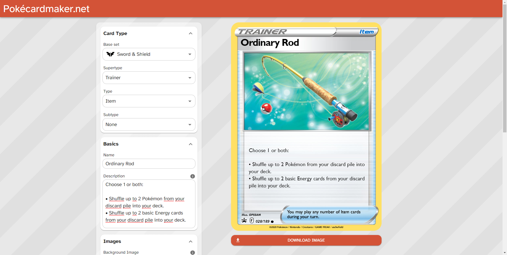

# Pokécardmaker.net
Pokécardmaker.net lets you create your own custom Pokémon cards in the modern Sword and Shield format, including Pokémon-V, V-Max and Full Art Trainers!

### [Use the tool on https://pokécardmaker.net](https://pokecardmaker.net)
\

---

## Setup
- Run `npm i`
- Copy `.env.example` into `.env` and fill in properties to your liking
    - It is recommended to not add a `NEXT_PUBLIC_GTM_ID` value during development, as this will only slow things down

## Scripts
- To start the dev server, run `npm start` or `npm run dev`
- To validate TypeScript types, run `npm run typecheck`
- To lint the code, run `npm run lint`
- To fix possible lint errors in the code, run `npm run lint:fix`
- To optimize all images in the assets folder, run `npm run optimize:images`

## Adding new cards
In order to add new cards, set icons, rarity icons or rotation icons, a few steps are required. Here is an example of adding a new set icon:
1. Add the set icon data to the [data file](.\src\features\cardEditor\cardOptions\setIcon\data.ts) and make sure to add it to the export array
    - `.\src\features\cardEditor\cardOptions\setIcon\data.ts`
2. Add the set icon image _(must be a PNG)_ to the [set icons folder](.\public\assets\icons\sets)
    - `.\public\assets\icons\sets`
3. Make sure the image name is the same as the `slug` you added at step 1

When adding new card types, there's more things to take care of:
- When adding the card data, make sure to link it everywhere where needed.
    - For example, check out the [type data](.\src\features\cardEditor\cardOptions\type\data.ts). Here you can see that all types that are Pokémon types, like 'Grass', are linked with the `pokemon` supertype.
- When adding the card image, make sure to put it in the correct folder structure. This is very important, because this is how the card creator finds the images automatically.
    - For example, check out [the type image folder](.\public\assets\cards\baseSets\swordAndShield\supertypes\pokemon\types). This is where all different Pokémon types are stored. Within that folder, all subtype images can be found. The other folders, like `/basic/rarity` means that this is where all the `rarity` images that fall under the type `basic` are stored.
    - This might not make a lot of sense so feel free to poke around or create an issue on GitHub to ask any questions.
- After adding new card images, run `npm run create:data` or restart your compiler to refresh the data
